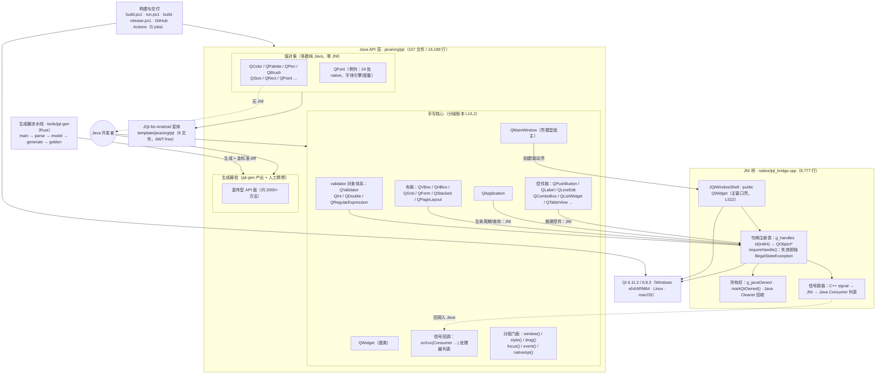
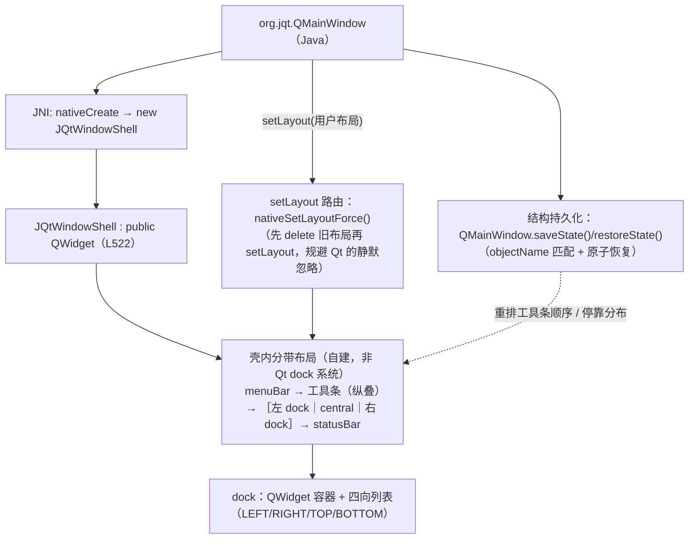
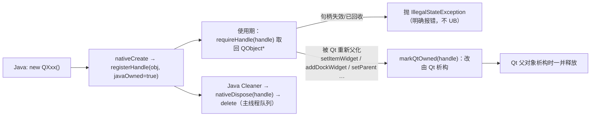
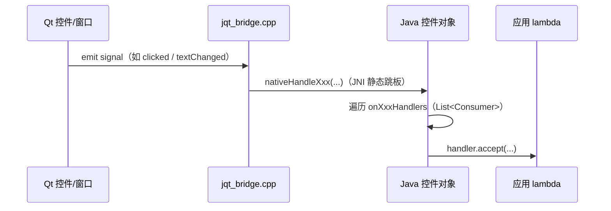
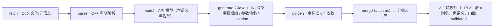
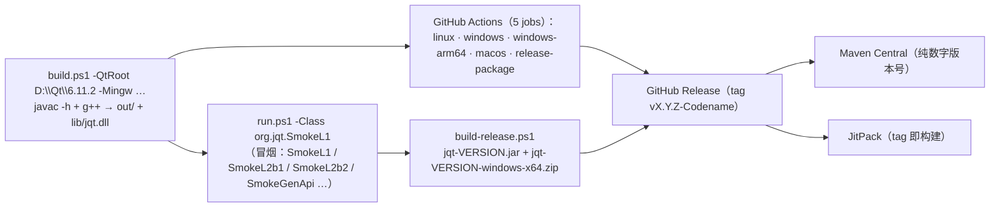

# JQt 架构（权威版）· Architecture (Authoritative)

> 数据基线：**v1.8.0-Emerge-Kit**（2026-09-07）。所有数字均为仓库实测，可复现（见文末命令）。
> English summary: JQt is a **hand-crafted** Qt 6 binding for Java. Controls go through a JNI bridge with an
> explicit handle registry and ownership model; most value objects are **pure Java** reimplementations;
> `QMainWindow` is emulated by a C++ `JQtWindowShell` because Qt's real `QMainWindow` forbids `setLayout`.
> A Rust generator produces the bulk-but-boring API surface; the tiered core (L1/L2) is hand-written.

---

## 1. 分层总览



## 2. 主窗口壳模型（JQt 最特有的结构）

Qt 的真 `QMainWindow` 不允许 `setLayout()`；JQt 的模型是**「窗口 = 布局宿主」**，
因此 `org.jqt.QMainWindow` 背后不是 Qt 的 `QMainWindow`，而是 C++ 侧自建的壳：



**含义**：`QMainWindow.saveState/restoreState` 不是 Qt 的透传——壳没有 Qt 的 dock 状态机，
我们序列化的是**自身壳结构**（chrome 存在性 + 工具条顺序 + 四向停靠分布）。IDE 级停靠交互
（浮动/拖拽/tabify）属后续 dock 管理器立项。

## 3. 对象生命周期与所有权



要点：**谁创建谁负责，重父化即转移**。桥不做猜测式 delete，避免 Qt/Java 双重释放。

## 4. 信号回调路径


- 首次 `onXxx(handler)` 才建立原生连接（惰性 `nativeConnectXxx`），无监听零成本。
- 回调在 Qt 主线程；Java 侧只做分发，不做线程切换假设。

## 5. 生成器流水线与人工精修


- 生成器负责"多而无聊"的直传面；**分级核心（docs/api-tiering.md 的 L1/L2）由人写**——这是 JQt 的质量护城河。

## 6. 构建与交付


- 版本约定：`1.8.0-Emerge-Kit` = 语义版本 + 代号；**Maven Central 用纯数字 `1.8.0`**。
- 平台矩阵：Qt **6.8.3 LTS** 与 **6.11.2** 双版本 × Windows x64 / Windows ARM64 / Linux / macOS。
- Android 走独立模板（`JQt-for-Android/`），Java 层为 AWT-free 值对象子集（8 文件）。

## 7. 有意为之的"不存在"（避免误读）

| 常被误画成 | 事实 |
|---|---|
| Java 层全部经 JNI 调 Qt | 值对象多为**纯 Java 重实现**（QColor 106 个 public 方法、零 native）；仅 QFont 部分委托 native |
| QMainWindow → JNI → Qt::QMainWindow | 背后是 **`JQtWindowShell : QWidget`**（壳模型，见 §2） |
| JNI 桥只是一个转发盒子 | 桥含**句柄注册表 + 所有权模型 + 信号跳板 + 壳实现**（9,777 行） |
| 全部 API 都由生成器产出 | 生成器只做直传面；**L1/L2 核心手写**（L1 蓝图 178/178 完成） |

## 8. 数字复现命令

```powershell
(Get-ChildItem java/org/jqt -Filter *.java -Recurse).Count                     # 157
(Get-ChildItem java/org/jqt -Filter *.java -Recurse | Get-Content | Measure-Object -Line).Lines   # 16189
(Get-Content native/jqt_bridge.cpp | Measure-Object -Line).Lines               # 9777
(Get-ChildItem tools/jqt-gen/src -Filter *.rs).Name                            # main/parse/model/generate/golden
(Get-ChildItem 'JQt-for-Android/template/java/org/jqt' -Filter *.java).Count   # 8
```
